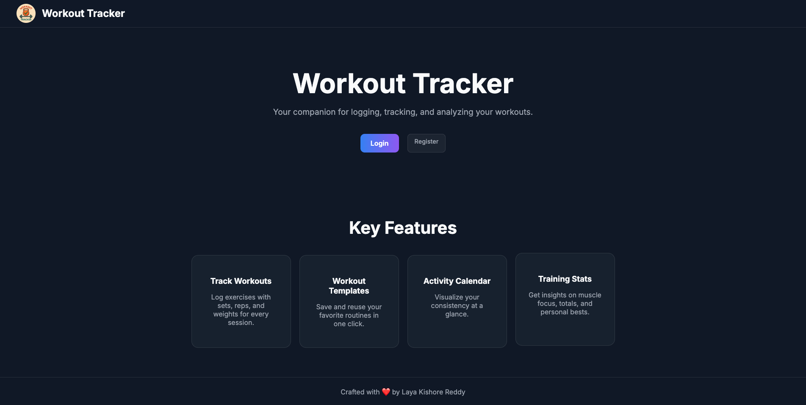
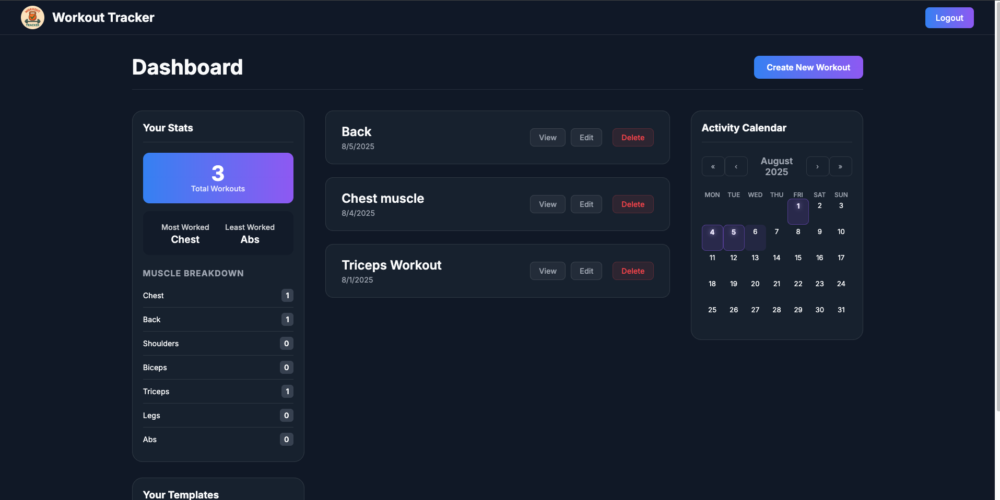
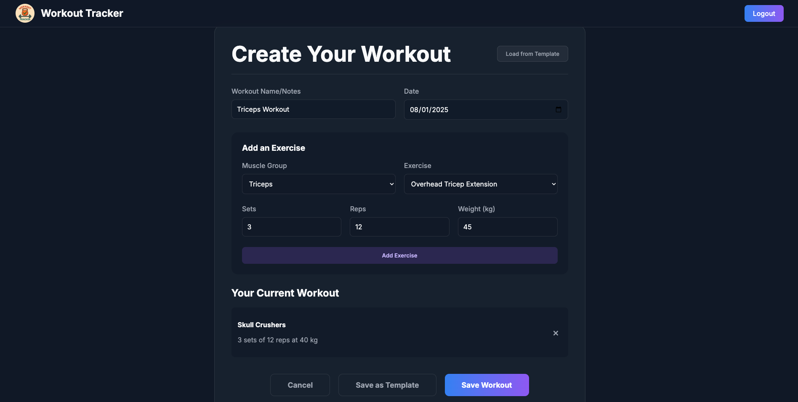
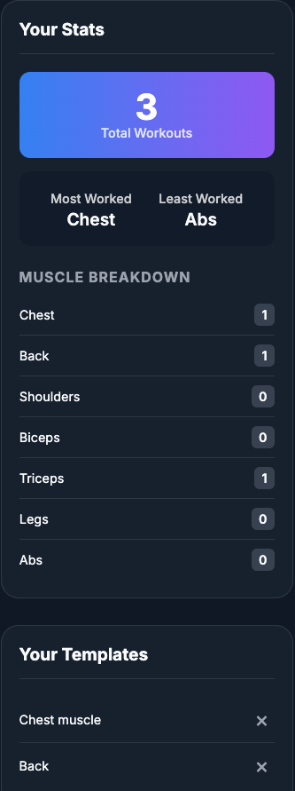
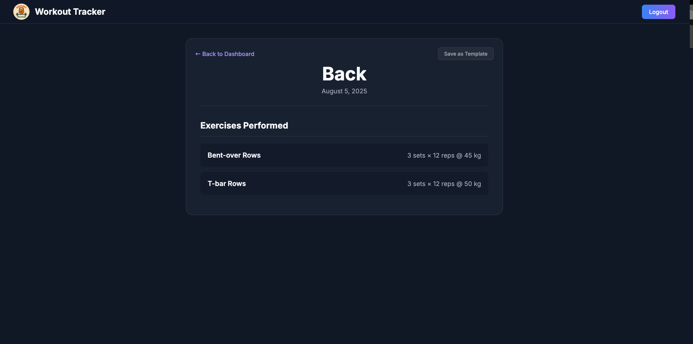

<div align="center">
  
  <h1>Workout Tracker</h1>
  <p>A modern, feature-rich web application designed to help you track your workouts, monitor your progress, and stay motivated on your fitness journey.</p>
  <p>🚀 Live Demo: <a href="https://track-gymworkouts.netlify.app" target="_blank">track-gymworkouts.netlify.app</a></p>
</div>

---

## 🖼️ Screenshots

<div align="center">
  
  
  
  
  
</div>

---

## ✨ Key Features

- **Secure Authentication**: JWT-based login, registration, and “Forgot Username/Password” flows with email OTP.
- **Workout CRUD**: Create, view, edit, and delete workouts with multiple exercises.
- **Workout Templates**: Save any workout as a template and load it instantly when creating new sessions.
- **Interactive Dashboard**:  
  - **Activity Calendar** with highlighted workout days.  
  - **Training Stats** including total workouts, muscle-group breakdown, most/least-worked muscles.
- **Sleek UI**: “Neon Pulse” dark theme with glassmorphism, fluid animations, and responsive design.

---

## 🚀 Technologies Used

- **Frontend**: React, Vite, React Router, Axios, React Context API, CSS3 (Flexbox, Grid, Custom Properties)
- **Backend**: Java, Spring Boot, Spring Security (JWT), JPA/Hibernate, PostgreSQL
- **Utilities**: react-calendar

---

## 🔧 Getting Started

1. Clone this repository  
   ```bash
   git clone https://github.com/Layakishorereddy11/WORKOUT_TRACKER_FRONTEND.git
   cd WORKOUT_TRACKER_FRONTEND
   ```
2. Install dependencies  
   ```bash
   npm install
   ```
3. Set your API URL (optional) in `.env`  
   ```env
   VITE_API_BASE_URL=https://api.myworkouttracker.com/api
   ```
4. Run the development server  
   ```bash
   npm run dev
   ```
5. Open your browser at `http://localhost:5173`

---

## 📥 Deployment

This app is configured for one-click deployment on Netlify via `netlify.toml`:

```toml
[build]
  command = "npm run build"
  publish = "dist"

[[redirects]]
  from  = "/*"
  to    = "/index.html"
  status = 200
```

Just push your changes to GitHub, connect your repo in Netlify, and it will build & deploy automatically!

---

<p align="center">Crafted with ❤️ by Laya Kishore Reddy</p>
