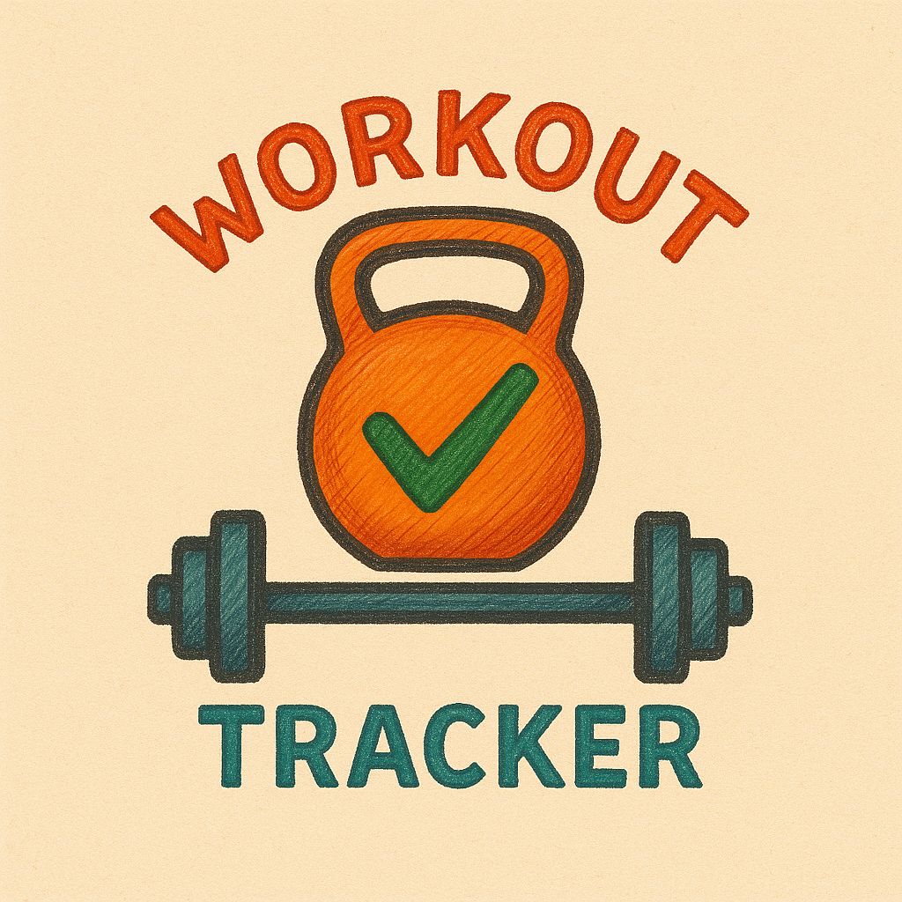

<div align="center">
  
  <h1>Workout Tracker</h1>
  <p>A modern, feature-rich web application designed to help you track your workouts, monitor your progress, and stay motivated on your fitness journey.</p>
</div>

---

## ✨ Key Features

This application is built with a user-centric design and provides a comprehensive suite of tools for any fitness enthusiast.

### Core Functionality
- **Secure User Authentication**: JWT-based login and registration system with persistent sessions.
- **Full Workout CRUD**: Create, view, update, and delete your workout sessions with ease.
- **Workout Templates**: Save any workout as a reusable template and load it instantly to start a new session, saving time and effort.
- **Intuitive Workout Creation**: A guided form allows you to dynamically add exercises, select muscle groups, and specify sets, reps, and weight.

### Interactive Dashboard
The main dashboard is a central hub designed for at-a-glance insights and motivation.
- **Dynamic Stats Panel**: Automatically calculates and displays key metrics, including:
  - Total workouts logged.
  - Breakdown of sessions per muscle group.
  - Your most and least trained muscle groups.
- **Sorted Workout History**: Your workout sessions are always displayed with the most recent at the top.
- **Activity Calendar**: A beautiful, integrated calendar that highlights all the days you've worked out, giving you a visual representation of your consistency.

### Modern UI/UX
- **"Neon Pulse" Dark Theme**: A sleek, high-contrast dark theme with glassmorphism effects for a premium feel.
- **Responsive Design**: The interface is designed to be fully functional and aesthetically pleasing on all screen sizes.
- **User-Friendly Interactions**: Features like confirmation dialogs on data overwrite and subtle animations make the app feel robust and satisfying to use.

---

## 🚀 Technologies Used

This project leverages a modern and powerful tech stack to deliver a fast and reliable user experience.

- **Frontend**: React, Vite
- **Routing**: React Router DOM
- **State Management**: React Context API for global authentication state.
- **API Communication**: Axios with interceptors for automatic JWT handling and token expiration management.
- **UI Components**: `react-calendar` for activity visualization.
- **Styling**: Modern CSS with Flexbox, Grid, Custom Properties, and animations.

---

## 🔧 Getting Started

To get a local copy up and running, follow these simple steps.

### Prerequisites
- Node.js (v18 or later)
- npm

### Installation
1. Clone the repository:
   ```sh
   git clone https://github.com/your-username/your-repo-name.git
   ```
2. Navigate to the project directory:
   ```sh
   cd your-repo-name
   ```
3. Install NPM packages:
   ```sh
   npm install
   ```
4. Start the development server:
   ```sh
   npm run dev
   ```
5. Open your browser and navigate to `http://localhost:5173` (or the port specified in your terminal).

---

## 🔮 Future Enhancements

This project has a bright future! Here are some of the exciting features planned for upcoming versions:

- **Exercise Progress Charts**: Visualize your strength gains over time with charts for specific exercises.
- **Personal Record (PR) Tracking**: Automatically detect and celebrate your personal bests.
- **Custom Exercises**: Allow users to add their own unique exercises to the database.
- **User Profile & Settings**: A dedicated page for user preferences, like choosing between kg/lbs.
